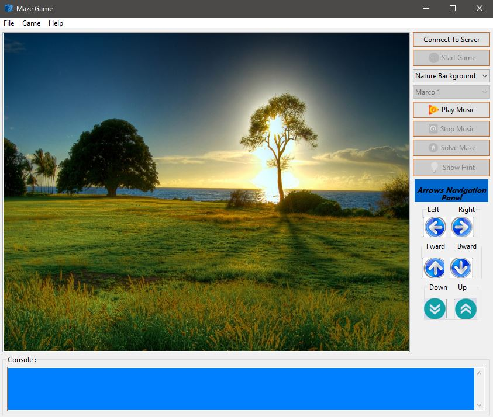
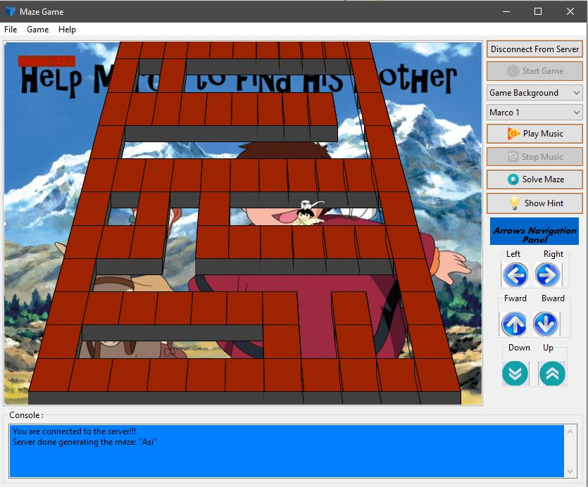

# 

## Description

The game generates random mazes in whatever sizes you'd like using:
<dl>
  <dt>Growing Tree Algorithm - http://weblog.jamisbuck.org/2011/1/27/maze-generation-growing-tree-algorithm </dt>
</dl>

The maze can be solved by the following algorithms:

<dl>
  <dt>BFS Algorithm - http://www.geeksforgeeks.org/breadth-first-traversal-for-a-graph/ </dt>
</dl>

<dl>
  <dt>DFS Algorithm - http://www.geeksforgeeks.org/depth-first-traversal-for-a-graph/ </dt>
</dl>

<dl>
  <dt>A*-Manhattan Distance Algorithm - http://theory.stanford.edu/~amitp/GameProgramming/Heuristics.html </dt>
</dl>

<dl>
  <dt>A*-Air Distance Algorithm - http://theory.stanford.edu/~amitp/GameProgramming/Heuristics.html </dt>
</dl>

## Project Architecture

The project using mvp architecture and  includes various design patterns, such as Observer Pattern, Strategy pattern and Adapter Pattern.

## Demo

video preview on youtube: https://www.youtube.com/watch?v=cgcbFZgwRBg

## Screenshots

